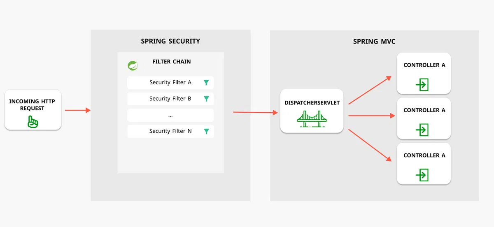

[1. Bean](#1-bean)  
[2. Tại sao nên dùng constructor inject thay vì @Autowired](#1-rabbitmq)      
[1. Sự khác nhau khi khai báo dependency trong <dependencies> và trong <dependencyManagement>](#1-bean)      
[1. Spring Security](#1-spring-security)  

### 1. Bean

Bean là những module chính của chương trình, được quản lý và cấu hình bởi Spring IoC Container. Các bean trong Spring Boot được quản lý bởi ApplicationContext (là một loại IoC Container).

Để Spring biết được đâu là bean thì cần phải đánh dấu `@Component`, `@Service`, `@Controller`,..v..v….

Bean trong Spring Boot thường là các đối tượng có thể được tái sử dụng, và chúng có thể được tiếp cận từ bất kỳ đâu trong ứng dụng.

**Quá trình khởi tạo và vòng đời:**

Spring Boot tạo bean instance thông qua quá trình quản lý bean của mình, dựa trên các annotations và cấu hình cung cấp. Các bước chính để Spring Boot tạo bean instance là:

1. **Quét (Scanning)**: Spring Boot quét toàn bộ project của bạn để tìm các lớp được đánh dấu bằng các annotations như `@Component`, `@Service`, `@Repository`, `@Controller`, v.v...
2. **Đăng ký (Registration)**: Khi tìm thấy các lớp được đánh dấu, Spring Boot đăng ký các lớp đó vào ApplicationContext như các bean. Điều này cho phép bạn có thể tiếp cận và sử dụng các bean này từ bất kỳ đâu trong ứng dụng.
3. **Khởi tạo (Initialization)**: Sau khi đăng ký, Spring Boot khởi tạo các bean bằng cách sử dụng các constructor, setter method, hoặc factory method đã cung cấp.
4. **Cấu hình (Configuration)**: có thể cấu hình các bean bằng cách sử dụng các annotations như `@Autowired` để tự động inject các phụ thuộc (dependencies) vào bean, `@Value` để inject giá trị từ file properties, hoặc các annotations khác để chỉ định phương thức cấu hình.
5. **Quản lý vòng đời (Lifecycle Management)**: Spring Boot quản lý vòng đời của các bean, bao gồm việc khởi tạo, inject phụ thuộc, gọi các phương thức khởi động và hủy các bean khi cần thiết.

### 2. Tại sao nên dùng constructor inject thay vì @Autowired
- Tránh được lỗi NullPointerException do dependency được gán ngay trong lúc khởi tạo object
- Tạo ra tính bất biến (Immutability) do các dependency được gán một lần duy nhất và không thay đổi được sau đó

### 3. Sự khác nhau khi khai báo dependency trong <dependencies> và trong <dependencyManagement>

1. `<dependencies>`
   
- Chức năng: Khai báo trực tiếp các thư viện mà module cần sử dụng.

- Hiệu lực: Các dependencies được khai báo tại đây sẽ được Maven tải về và bao gồm trong classpath của module.

- Yêu cầu: Phải chỉ định đầy đủ thông tin, bao gồm phiên bản (version).

2. `<dependencyManagement>`

- Chức năng: Định nghĩa phiên bản và các thông tin cấu hình cho dependencies mà các module con có thể sử dụng.

- Hiệu lực: Không tự động thêm dependencies vào module; chỉ cung cấp thông tin để các module con có thể khai báo dependencies mà không cần chỉ định phiên bản.

- Lợi ích: Giúp quản lý tập trung phiên bản của các dependencies, tránh xung đột phiên bản giữa các module.

*Ví dụ*, nếu  khai báo một dependency trong `<dependencyManagement>` của parent POM, các module con có thể sử dụng dependency đó mà không cần chỉ định phiên bản, miễn là họ khai báo dependency đó trong `<dependencies>` (khai báo trong `<dependencyManagement></dependencyManagement>` là để khai báo, còn muốn dùng chung thì phải khai báo thêm trong `<dependencies>`).

### Spring Security

Spring Security hoạt động theo mô hình client-server. Khi một client gửi một request đến server, server sẽ xác thực người dùng và phân quyền để đảm bảo rằng người dùng chỉ có thể truy cập vào những tài nguyên mà họ được phép truy cập.

Cơ chế hoạt động của Spring Security dựa trên cơ chế lọc (filter) và sự kiện (event) để can thiệp vào quá trình xử lý yêu cầu (request) và phản hồi (response) của ứng dụng web, tức là khi một yêu cầu được gửi đến ứng dụng web, nó sẽ được chuyển qua một chuỗi các bộ lọc (filter chain) do Spring Security quản lý. Mỗi bộ lọc có một nhiệm vụ cụ thể, như kiểm tra xác thực, kiểm tra phân quyền, điều hướng đến trang đăng nhập hoặc đăng xuất, xử lý các lỗi bảo mật.

Nếu một yêu cầu không thỏa mãn các điều kiện bảo mật của ứng dụng, Spring Security sẽ sinh ra một sự kiện (event) để thông báo cho ứng dụng biết. Ứng dụng có thể lắng nghe và xử lý các sự kiện này theo ý muốn, ví dụ như ghi log, gửi email hoặc hiển thị thông báo lỗi.

Ngược lại, nếu một yêu cầu được chấp nhận bởi Spring Security, nó sẽ được tiếp tục xử lý bởi ứng dụng web như bình thường. Khi ứng dụng web trả về một phản hồi cho yêu cầu, nó cũng sẽ được chuyển qua lại chuỗi các bộ lọc của Spring Security để áp dụng các thiết lập bảo mật cho phản hồi.

Và cơ chế ấy bao gồm 3 thành phần chính:
- Authentication
- Authorization
- Authentication Provider