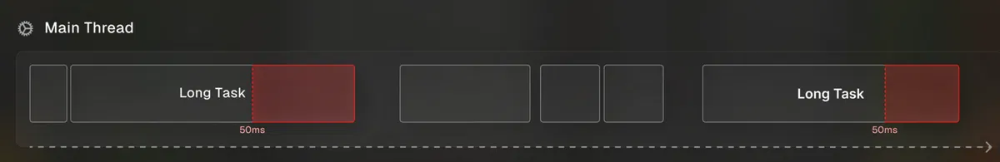

# Câu hỏi phỏng vấn Node.js

## Node.js là gì

Nodejs là một nền tảng được xây dựng, vận hành tại V8 JavaScript runtime của Chrome. Với Nodejs, bạn có thể chạy JavaScript trên server và thể xây dựng, phát triển các ứng dụng mạng nhanh chóng và dễ dàng.

Nền tảng này bắt đầu được xây dựng, phát triển tại California từ năm 2009 với phần core phía dưới được lập trình bằng C++ gần như 100%. Điều này tạo nên ưu thế về tốc độ xử lý cũng như hiệu năng của nền tảng này. Đến nay, Nodejs vẫn đang "gây bão" trong cộng đồng công nghệ bởi khả năng phát triển ứng dụng vượt trội.

## Mục lục

[1. Node.js hoạt động thế nào?](#1-nodejs-hoạt-động-thế-nào)   
[2. Event Loop](#2-event-loop)
[3. Web worker](#3-web-worker)

### 1. Node.js hoạt động thế nào?

Node hoàn toàn theo cơ chế event-driven. Về cơ bản server bao gồm một luồng duy nhất xử lý từ sự kiện này đến sự kiện khác.

Một yêu cầu mới đến là một loại sự kiện. Server bắt đầu xử lý nó và khi có hoạt động blocking IO, nó sẽ không đợi cho đến khi hoàn thành mà thay vào đó sẽ đăng ký một hàm callback. Sau đó, server ngay lập tức bắt đầu xử lý một sự kiện khác (có thể là một yêu cầu khác). Khi hoạt động IO kết thúc, đó là một loại sự kiện khác và server sẽ xử lý nó (tức là tiếp tục làm việc theo yêu cầu) bằng cách thực hiện lệnh callback ngay khi có thời gian.

Vì vậy, server không bao giờ cần tạo thêm các luồng hoặc chuyển đổi giữa các luồng, có nghĩa là nó có rất ít chi phí. Nếu bạn muốn sử dụng đầy đủ nhiều lõi phần cứng, bạn chỉ cần bắt đầu nhiều đối tượng node.js

Nền tảng Node.js không tuân theo mô hình đa luồng. Mà nó theo mô hình đơn luồng với Event Loop. Mô hình xử lý trong Node.js chủ yếu dựa trên mô hình JavaScript Event và cơ chế callback.

Các bước trong mô hình xử lý đơn luồng với Event Loop:
- Client gửi yêu cầu đến web server.
- Web server Node.js duy trì một Thread pool để cung cấp dịch vụ cho các yêu cầu từ client.
- Node.js nhận các yêu cầu này và đặt nó vào một hàng đợi. Gọi là Event Queue.
- Trong Nodejs có một thành phần là Event Loop. Nó sử dụng một vòng lặp để nhận yêu cầu và xử lý chúng.
- Event Loop sử dụng một luồng duy nhất. Nó được gọi là trái tim của Node.js
- Event Loop kiểm tra yêu cầu có ở trong Event Queue. Nếu khong nó sẽ đợi cho đến khi yêu cầu đến.
- Nếu có, nó lấy yêu cầu từ Event Queue:
    - Nó bắt đầu xử lý yêu cầu đó.
    - Nếu yêu cầu đó không phải là blocking IO, thì nó xử lý và chuẩn bị phản hồi để gửi về client.
    - Nếu nó cần vài thao tác blocking IO như tương tác với cơ sở dữ liệu, hệ thống file, mạng thì nó sẽ có cách tiếp cận khác:
        + Kiểm tra luồng khả dụng từ Thread Pool
        + Chọn luồng và gán nó cho yêu cầu client.
        + Các luồng này nhận yêu cầu và xử lý chúng thực hiện hành động blocking IO, chuẩn bị phản hồi và gửi nó về Event Loop.
        + Event Loop lấy nó và gửi phản hồi đó về lại client.
    
### 2. Event Loop

- JavaScript là ngôn ngữ theo kiến trúc single-thread, non-blocking I/O (khác với những ngôn ngữ khác, *ví dụ* như Java có thể có nhiều thread, và khi 1 luồng I/O hoạt động thì hệ thống sẽ block lại cho tới khi nào nó xử lý xong mới tiếp nhận luồng tiếp theo), thì JS vẫn chấp nhận các luồng xử lý khác trong khi có 1 luồng vẫn đang chạy
- Trong JS sẽ có 2 loại tác vụ là “đồng bộ” và “bất đồng bộ”, tất cả các hàm sau khi được gọi sẽ được đưa vào Call Stack (là 1 global execution context), ở đây:
    - Nếu như hàm là đồng bộ thì sẽ được xử lý và trả ra kết quả ngay, và sau đó được đẩy ra khỏi Call Stack
    - Nếu hàm là bất đồng bộ thì sẽ được đưa qua WebAPI để xử lý (WebAPI là 1 interface của browser, cung cấp bộ giao diện tương tác bao gồm các tính năng như: fetch, setTimeout, v.v..). WebAPI sau khi xử lý xong hàm bất đồng bộ sẽ trả ra kết quả (dưới dạng 1 callback) và đưa vào Callback Queue
- **EVENT LOOP** là 1 cơ chế của JavaScript Engine, nó có tác dụng là liên tục kiểm tra Call Stack và Callback Queue, nếu như thấy Call Stack đã trống thì nó sẽ lần lượt đẩy các hàm từ Callback Queue qua Call Stack (theo cơ chế của queue: first in first out), và từ Call Stack trả ra kết quả

 thứ tự ưu tiên: Code đồng bộ > Microtask (Promise then/catch/finally) > Macrotask (setTimeout/setInterval/fetch)

### 3. Web worker

**Web Worker** là 1 tính năng của **trình duyệt**, giúp tách biệt việc thực thi 1 đoạn code JS trên 1 luồng background, tách ra khỏi main thread (UI thread)

- Nếu không có web worker, thì tất cả các function sẽ chạy luôn trên main thread, và nếu có 1 function nào đó thực thi quá nặng, tốn quá nhiều thời gian, thì trong lúc đó main thread sẽ bị block lại, màn hình sẽ bị treo/đứng, ảnh hưởng tới trải nghiệm người dùng

***Long Tasks:** là bất kỳ tác vụ nào mất hơn 50ms để hoàn thành. 

Tại sao lại là 50ms?

- 60fps và 16ms: để giao diện mượt mà, trình duyệt cần cập nhật 60 khung hình mỗi giây, tức là mỗi khung hình trong khoảng 16ms.
- 50ms: giới hạn này cho phép browser có thời gian để thực hiện các tasks khác như xử lý tương tác người dùng và vẽ lại giao diện.

Vấn đề: khi một long tasks chạy trên main thread, nó chặn tất cả các tasks khác, dẫn đến giao diện bị giật lag, đơ, không phản hồi.

### **Đặc điểm của Web Worker**

- **Chạy trong luồng riêng**: Web Worker hoạt động trong một thread độc lập, không chia sẻ bộ nhớ với main thread. Nó sử dụng **message passing** (gửi/nhận message qua postMessage và onmessage) để giao tiếp.
- **Không truy cập DOM**: Web Worker không thể trực tiếp thao tác với DOM, window, hoặc các API liên quan đến UI (như document, window.alert).
- **Hỗ trợ tác vụ nặng**: Thích hợp cho các tác vụ như xử lý dữ liệu lớn, tính toán phức tạp, hoặc gọi API không đồng bộ mà không làm treo UI.
- **File riêng**: Code của Web Worker được viết trong một file JavaScript riêng (ví dụ: worker.js) và được khởi tạo từ main thread.

### **So sánh Web Worker và Event Loop**

| | **Web Worker** | **Event Loop** |
| --- | --- | --- |
| **Mục đích** | Chạy tác vụ nặng trong luồng riêng | Quản lý tác vụ bất đồng bộ trong luồng chính |
| **Luồng** | Đa luồng (main thread + worker thread) | Đơn luồng (main thread) |
| **Truy cập DOM** | Không thể truy cập DOM | Có thể truy cập DOM |
| **Hiệu năng** | Tốt cho tác vụ nặng, không chặn UI | Tốt cho tác vụ nhẹ, bất đồng bộ |
| **Cơ chế giao tiếp** | Message passing (postMessage) | Task Queue, Microtask Queue |
| **Tác vụ phù hợp** | Tính toán phức tạp, xử lý dữ liệu lớn | API call, setTimeout, Promise, sự kiện |
| **Triển khai** | File JS riêng (worker.js) | Tự động trong engine JavaScript |