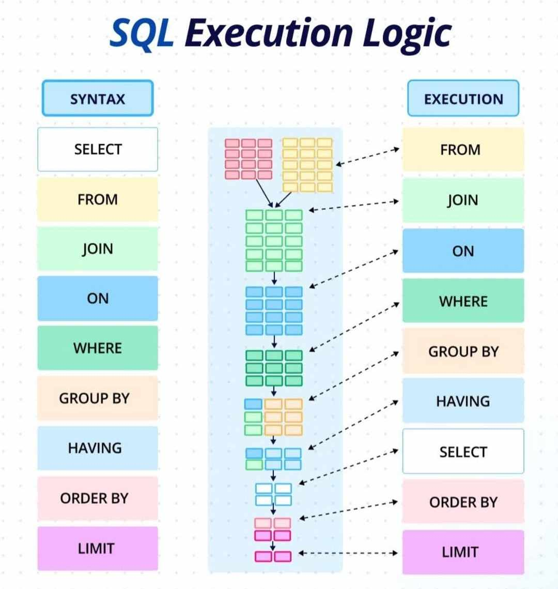
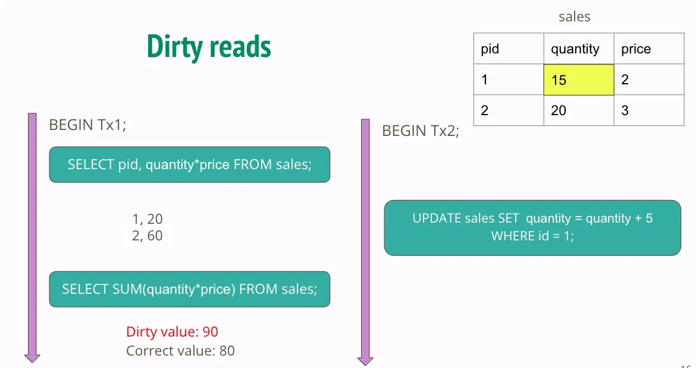
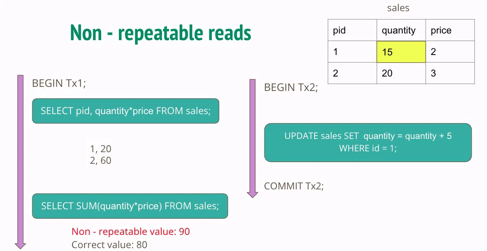
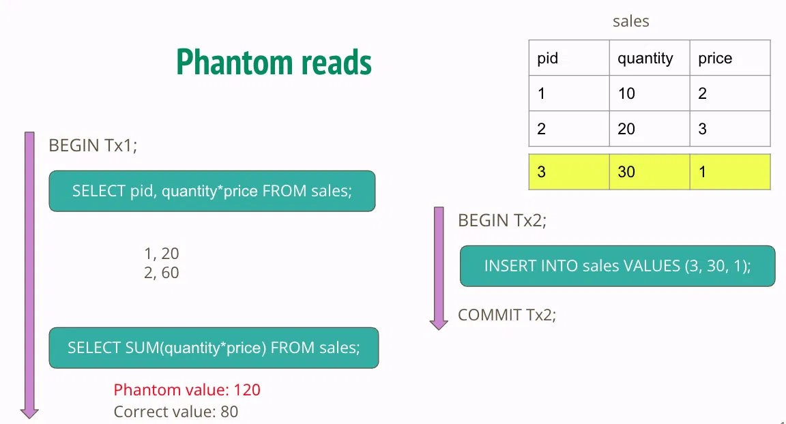
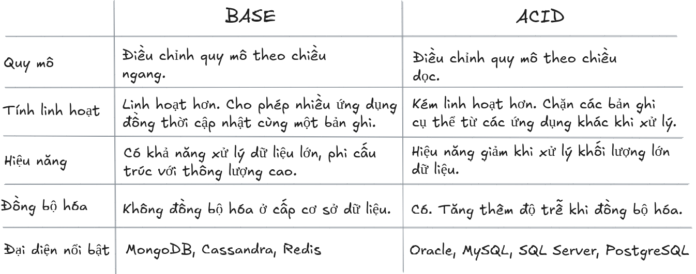
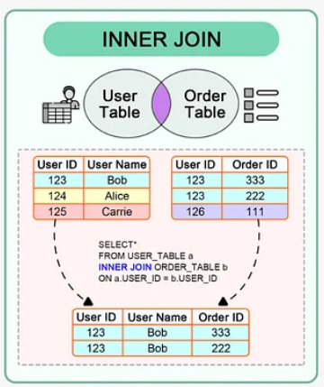
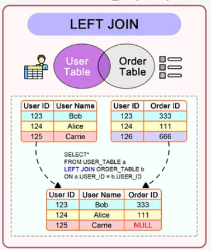
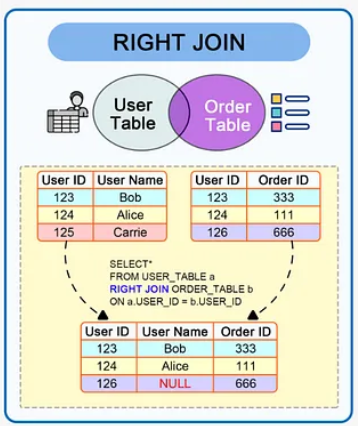
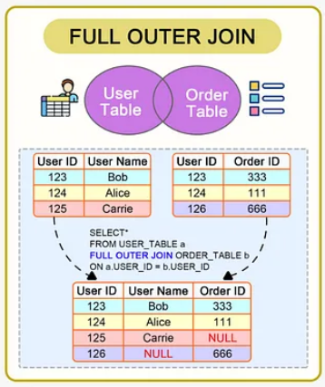

## Table of content

[1. Thứ tự khai báo và thứ tự thực thi câu lệnh SQL](#1-nguyen-ly-solid)  
[2. Transaction](#2-transaction)  
[3. Tính chất ACID](#3-tính-chất-acid)   
[4. JOIN trong SQL](#4-join-trong-sql)    
[5. View trong SQL](#5-view-trong-sql)     
[6. Trigger](#6-trigger)    
[7. Function](#7-function)    
[8. Store Procedure](#8-store-procedure)    
[9. Partition](#9-partition)    
[10. Sharding](#10-sharding)    
[11. Window Function](#11-window-function)   
[12. CTE vs Subquery](#12-cte-vs-subquery)
[13. Optimistic lock và Pessimistic lock](#12-cte-vs-subquery)


### 1. Thứ tự khai báo và thứ tự thực thi câu lệnh SQL

1. `SELECT` → Chỉ định các cột hoặc biểu thức cần trả về.     
2. `FROM` → Chỉ định bảng (hoặc bảng ảo/view) để lấy dữ liệu.   
3. `JOIN ... ON` → Kết hợp dữ liệu từ nhiều bảng dựa trên điều kiện.   
4. `WHERE` → Lọc dữ liệu trước khi nhóm (GROUP BY).   
5. `GROUP` BY → Nhóm dữ liệu theo một hoặc nhiều cột.   
6. `HAVING` → Lọc dữ liệu sau khi nhóm (tương tự WHERE nhưng dành cho GROUP BY).   
7. `ORDER` BY → Sắp xếp kết quả trả về.   
8. `LIMIT` → Giới hạn số lượng bản ghi trả về.    
9. `OFFSET` → Bỏ qua một số bản ghi trước khi trả về kết quả.    


SELECT và FROM là bắt buộc phải có, còn lại là optional

### **Chiến lược thực thi:**

**1. Query Optimizer**

**Query Optimizer** là một thành phần quan trọng trong hầu hết các hệ quản trị cơ sở dữ liệu. Nó phân tích câu lệnh SQL được gửi đến và tạo ra một kế hoạch thực thi tối ưu dựa trên nhiều yếu tố như:

- **Các chỉ mục (Indexes)**: Tận dụng các chỉ mục để tìm kiếm nhanh các dòng dữ liệu.
- **Thống kê (Statistics)**: Phân tích thống kê về dữ liệu để ước tính số lượng dòng và chọn kế hoạch thực thi phù hợp.
- **Phương pháp nối (Join Methods)**: Quyết định cách thức nối các bảng (nested loop join, hash join, merge join) để giảm thiểu số lượng phép so sánh.

**2. Phân tích và Tiền xử lý**

Trước khi thực thi, hệ quản trị cơ sở dữ liệu thực hiện các bước tiền xử lý để chuẩn bị dữ liệu:

- **Phân tích cú pháp (Parsing)**: Phân tích câu lệnh SQL để kiểm tra cú pháp và xác định cấu trúc.
- **Phân tích hình thức (Semantic Analysis)**: Kiểm tra tính hợp lệ của câu lệnh, bao gồm kiểm tra sự tồn tại của các bảng và cột được đề cập.
- **Tối ưu hóa biểu thức (Expression Optimization)**: Tối ưu hóa các biểu thức logic trong câu lệnh, ví dụ như điều kiện WHERE.

**3. Thực thi và Quản lý Transaction**

Khi câu lệnh đã được tối ưu hóa và tiền xử lý, DBMS thực thi nó bằng cách:

- **Lập kế hoạch thực thi (Execution Planning)**: Lựa chọn phương pháp thực thi câu lệnh dựa trên kế hoạch tối ưu được sinh ra bởi trình tối ưu hóa.
- **Thực thi (Execution)**: Thực hiện các hoạt động như tìm kiếm, cập nhật, xóa, nối bảng, và sắp xếp dữ liệu theo kế hoạch đã chọn.
- **Quản lý Transaction**: Đảm bảo tính toàn vẹn dữ liệu bằng cách quản lý transaction, bao gồm bắt đầu (begin), hoàn thành (commit), và hủy bỏ (rollback) transaction.

**4. Đánh giá và Tối ưu hóa**

Sau khi thực thi, hệ quản trị cơ sở dữ liệu có thể đánh giá hiệu suất và tối ưu hóa các câu lệnh để cải thiện quá trình thực thi trong tương lai:

- **Thu thập thống kê và Phân tích hiệu suất**: Thu thập dữ liệu về các thực thi trước đó để phân tích và cải thiện hiệu suất.
- **Cập nhật thống kê và chỉ mục**: Cập nhật thống kê dữ liệu và tái cấu trúc các chỉ mục để tối ưu hóa thực thi.
- **Cải tiến kế hoạch thực thi**: Tùy chỉnh kế hoạch thực thi dựa trên dữ liệu thực tế để đạt hiệu suất tối ưu.

### 2. Transaction

**Transaction:** là 1 hoặc tập hợp nhiều các câu query trong cơ sở dữ liệu.

*Ví du:* Chuyển $100 từ Account 1 tới Account 2: transaction này bao gồm các hoạt động của cơ sở dữ liệu như sau:

- Tạo một record để chuyển 100 từ tài khoản A tới tài khoản B. Đây thường được coi là **BEGIN** của transaction.
- Đọc số dư của tài khoản 1:Nếu số dư của tài khoản 1 ≥ 100, trừ tài khoản 1 đi 100.
- Đọc số dư của tài khoản 2.
- Cộng 100 vào số dư của tài khoản 2.
- Nếu mọi thứ thành công, transaction sẽ được **COMMIT** để đánh dấu sự thay đổi trong cơ sở dữ liệu là vĩnh viễn. Nếu có lỗi xảy ra thì transaction sẽ được **ROLLBACK**, tức mọi thay đổi sẽ trở về trạng thái ban đầu

**1. Start Transaction**: Khi bắt đầu một transaction, mọi thay đổi dữ liệu được thực hiện trong các câu lệnh SQL sẽ tạm thời được lưu trong bộ nhớ tạm (transaction log).
    
Các câu lệnh SQL như `INSERT`, `UPDATE`, `DELETE` sẽ thực hiện các thay đổi dữ liệu nhưng không ghi ngay vào cơ sở dữ liệu vật lý. Thay vào đó, chúng được ghi vào transaction log của hệ quản trị cơ sở dữ liệu (DBMS). Trong quá trình này, dữ liệu thay đổi chỉ tồn tại trong transaction log. Nó không phản ánh vào cơ sở dữ liệu vật lý và sẽ không có hiệu lực cho các phiên làm việc khác.
    
**Thông tin ghi vào transaction log**: Mỗi lần thực hiện một trong các thao tác trên, DBMS sẽ ghi vào transaction log các thông tin quan trọng như:
    
- Loại thao tác (INSERT, UPDATE, DELETE).
- Bảng và cột bị ảnh hưởng.
- Giá trị cũ và giá trị mới của dữ liệu (nếu áp dụng).
- Thời gian thực hiện thao tác.
- Các thông tin khác như người dùng thực hiện thao tác, ID của transaction.
    
    **Mục đích của việc ghi vào transaction log**:
    
    - **Phục hồi (Recovery)**: Transaction log hỗ trợ quá trình phục hồi dữ liệu sau khi xảy ra sự cố. Nếu có lỗi xảy ra sau khi thực hiện một transaction nhưng trước khi commit, DBMS có thể sử dụng transaction log để rollback (hoàn tác) các thay đổi đã được ghi nhận.
    - **Replication và standby**: Transaction log cũng được sử dụng để đồng bộ dữ liệu giữa các server (replication) và để duy trì các bản sao dữ liệu (standby) cho mục đích khôi phục dữ liệu sau khi sự cố xảy ra.
    
**Kiểm tra ràng buộc và điều kiện**: Trước khi commit, DBMS sẽ kiểm tra các ràng buộc (constraints) như khóa ngoại, ràng buộc duy nhất (unique constraints), và các điều kiện logic khác để đảm bảo rằng dữ liệu sẽ không bị lỗi hoặc vi phạm các ràng buộc này
    
**Quản lý concurrency và isolation**: Quá trình này diễn ra trong một môi trường cô lập (isolation), nơi mà các transaction đang thực thi không ảnh hưởng đến nhau. Cơ chế này đảm bảo tính nhất quán của dữ liệu khi nhiều transaction cùng thực hiện đồng thời.
    
**2. Thực hiện commit**: Khi tất cả các thao tác trong transaction được thực hiện thành công và không có lỗi, DBMS sẽ thực hiện commit. Quá trình này đảm bảo rằng các thay đổi đã được ghi vào cơ sở dữ liệu vật lý và trở thành hiệu lực, sẵn sàng để được truy xuất và sử dụng bởi các transaction khác.

**3. Rollback**: Nếu có lỗi xảy ra hoặc người dùng quyết định không commit transaction, DBMS sẽ rollback (quay lại) các thay đổi bằng cách xóa transaction log tương ứng. Các thay đổi trong transaction sẽ không bị áp dụng vào cơ sở dữ liệu.


### 3. Tính chất ACID

<details>
<summary><b>A - Atomic</b></summary>

**A (Atomic) - Tính nguyên tử**: Tất cả các bước của 1 transaction đều phải được thực thi thành công, nếu có bất kỳ bước nào không thành công thì phải roll back lại hết từ đầu 
</details>

<details>
<summary><b>C - Consistency</b></summary>

**C - Consistency - Tính nhất quán:** Tính nhất quán yêu cầu rằng tất cả transaction chỉ có thể thay đổi dữ liệu theo những cách được cho phép.

*Ví dụ:*  Giả sử có 2 table là Account và User, trong đó table User có trường account_id tham chiếu đến khoá chính của table Account. Thì tính nhất quán yêu cầu chỉ được insert vào trường account_id của table User các giá trị đã có trong table Account
</details>

<details>
<summary><b>I - Isolation</b></summary>

**I - Isolation - Tính cô lập:** đảm bảo các transaction được thực thi một cách độc lập, không phụ thuộc lẫn nhau

*Ví du:* Trong transaction chuyển tiền từ người A sang người B, thì sẽ có nhiều thao tác như kiểm tra số dư người A, trừ tiền tài khoản người A, cộng tiền vào tài khoản người B. Thì tính cô lập quy định là khi transaction chuyển tiền đó đang được thực thi, mà nếu đồng thời có 1 transaction khác gọi đến tài khoản của người A để kiểm tra số dư, thì phải trả về kết quả là giá trị trước khi transaction bên trên được thực hiện, chứ không lấy kết quả mà transaction đang thực hiện giữa chừng

Trong tính cô lập, có hai khái niệm quan trọng là

- **Read phenomena** (Hiện tượng đọc): là tất cả những lỗi có thể xuất hiện khi nhiều người đọc và ghi vào cùng một dòng.
    
    Có 3 loại lỗi khi đọc phổ biến:
    1. Dirty reads: lỗi khi đọc những thay đổi chưa được commit.
   
    

    2. Non - repeatable reads: lỗi khi đọc thay đổi đã được commit.
 
    

    3. Phantom reads: lỗi đọc khi thêm record mới vào bảng.
    
    
- **Isolation levels** (Cấp độ cô lập): chỉ các cấp độ cô lập trong một transaction nhằm khắc phục hiện tượng đọc gây lỗi (Read phenomena)
    
    Có 4 cấp độ cô lập xếp theo thứ tự mức cô lập cao nhất tới thấp nhất. Mức cô lập càng cao thì hiệu năng lại càng giảm.
    
    1. **Serializable**: Các transaction được thực hiện thực hiện tuần tự. Đây là cấp độ cô lập cao nhất và có tính concurency thấp nhất.
    2. **Repeatable read**: Mỗi query trong 1 transaction chỉ nhìn thấy các thay đổi đã được commit trước khi transaction đó bắt đầu.
    3. **Read committed**: Mỗi query trong 1 transaction chỉ nhìn thấy các thay đổi đã được commit trước khi query bắt đầu.
    4. **Read uncommitted**: Transaction có thể đọc những thay đổi chưa được commit hoặc đã được commit bởi những transaction khác. Đây là cấp độ cô lập thấp nhất và có tính concurency cao nhất.

### **Làm sao giúp hệ thống đảm bảo Isolation?**

1. **Sử dụng hệ thống quản trị cơ sở dữ liệu (DBMS) tuân thủ ACID**: DBMS tuân thủ ACID có các cơ chế tích hợp sẵn để đảm bảo tính cô lập. Đây thường là các đơn giản nhất vì DBMS sẽ tự động xử lý giúp bạn.
2. **Triển khai Two-Phase Commit (2PC)**: Đây là một giao thức được sử dụng trong các hệ thống phân tán để đảm bảo rằng một transaction chỉ được cam kết nếu tất cả các nút tham gia đồng ý. Điều này đảm bảo rằng một transaction chỉ được cam kết khi tất cả các nút có dữ liệu được cập nhật và đồng bộ hóa.
</details>

<details>
<summary><b>D - Durability</b></summary>

**D - Durability: Tính bền vững:** đảm bảo rằng những transaction đã commit, kết quả của nó sẽ được lưu trữ vĩnh viễn và không thể thay đổi hoặc mất mát, ngay cả trong trường hợp có lỗi hệ thống, cúp điện hoặc các sự cố khác
</details>

### Trái ngược với tính chất ACID là tính chất BASE

 BASE là một nguyên tắc thiết kế trong hệ thống phân tán và thường được áp dụng trong các cơ sở dữ liệu NoSQL (không chỉ là SQL). BASE đối lập với ACID và tập trung vào tính khả dụng và khả năng mở rộng hơn là độ chính xác tuyệt đối ngay lập tức của dữ liệu.

- **BA - Basically Available** (Khả dụng cơ bản): Thay vì bắt buộc phải có tính nhất quán ngay lập tức, cơ sở dữ liệu NoSQL theo mô hình BASE sẽ đảm bảo tính khả dụng của dữ liệu bằng cách phân tán và sao chép dữ liệu trên các nút của cụm cơ sở dữ liệu.
- **S - Soft State** (Trạng thái mềm): Do thiếu tính nhất quán tức thời, các giá trị dữ liệu có thể thay đổi theo thời gian. Mô hình BASE tách ra với khái niệm về cơ sở dữ liệu bắt buộc tính nhất quán của riêng nó, giao phó trách nhiệm đó cho các nhà phát triển.
- **E -Eventual Consistency** (Nhất quán cuối cùng): Thực tế là BASE không bắt buộc phải nhất quán ngay lập tức nhưng không có nghĩa là nó không bao giờ đạt được điều đó. Tuy nhiên, cho đến khi nó đạt được, việc đọc dữ liệu vẫn có thể thực hiện được (mặc dù chúng có thể không phản ánh thực tế).



**Khi nào thì lựa chọn cơ sở dữ liệu BASE (NoSQL)?**

Cơ sở dữ liệu BASE (NoSQL) nhìn chung rất phù hợp với dữ liệu phi cấu trúc, ứng dụng quy mô lớn và quy trình phát triển linh hoạt. Ví dụ trong một số trường hợp không quá coi trọng tính nhất quán (như hiển thị số người đang xem livestream), cấu trúc dữ liệu linh hoạt (Document DB thường dùng làm phễu và tạm thời lưu trữ dữ liệu từ nhiều nguồn trước khi đổ vào Data Lake).


### 4. JOIN trong SQL

<details>
<summary><b>INNER JOIN</b></summary>



</details>

<details>
<summary><b>LEFT JOIN</b></summary>



</details>

<details>
<summary><b>RIGHT JOIN</b></summary>



</details>

<details>
<summary><b>FULL (OUTER) JOIN</b></summary>



</details>

<details>
<summary><b>SEFT JOIN</b></summary>

```sql
SELECT A.emp_id AS "Emp_ID",A.emp_name AS "Employee", B.emp_id AS "Sup_ID",B.emp_name AS "Supervisor"
FROM employee A, employee B
WHERE A.emp_sup = B.emp_id;
```

</details>

<details>
<summary><b>CROSS JOIN</b></summary>

```sql
SELECT column1, column2 FROM table1 CROSS JOIN table2
-- hoặc còn 1 cách viết khác tương tự
SELECT column1, column2 FROM table1, table2
```

kết quả là tích Descartes của 2 bảng (số dòng sẽ bằng số row table 1 * row table2)

</details>


### 5. View trong SQL

View là một bảng ảo dựa trên tập kết quả từ câu lệnh SQL. Một view bao gồm hàng và cột như một bảng thực. Các trường trong view là các trường từ một hay nhiều bảng thực ở cơ sở dữ liệu.

### 6. Trigger

### 7. Function

### 8. Store Procedure

### 9. Partition

### 10. Sharding

### 11. Window Function

### 12. CTE vs Subquery

### 13. Optimistic lock và Pessimistic lock