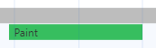

## Mục lục

[1. SSR - CSR - SSG - ISR](#1-ssr---csr---ssg---isr)  
[2. Cookies - Session Storage - Local Storage](#2-cookies---session-storage---local-storage)  
[3. Browser Rendering Pipeline](#3-browser-rendering-pipeline)
[6. Webpack va Babel](#6-webpack-va-babel) 

### 1. SSR - CSR - SSG - ISR

<details>
<summary><b>SSR (Server-side Rendering)</b></summary>

SSR (Server-Side Rendering) là kỹ thuật render giao diện (HTML) của ứng dụng React trên **server** thay vì trên client (trình duyệt). Khi người dùng truy cập trang, server sẽ trả về HTML đã được render hoàn chỉnh, sau đó trình duyệt tiếp tục "hydrate" để thêm tính tương tác JavaScript.

**Quy trình hoạt động**

1. **Yêu cầu từ trình duyệt**:
   - Người dùng truy cập một URL (ví dụ: example.com/about)
2. **Server xử lý**:
   - Next.js nhận yêu cầu và gọi hàm `getServerSideProps` (hoặc logic SSR tương ứng).
   - `getServerSideProps` lấy dữ liệu (ví dụ: từ API hoặc database) và truyền vào component React.
   - Next.js render component thành HTML trên server.
3. **Trả về HTML**:
   - Server trả về HTML đã render, cùng với các file JavaScript cần thiết.
4. **Hydration**:
   - Trình duyệt nhận HTML và hiển thị ngay lập tức (cải thiện tốc độ tải ban đầu).
   - JavaScript được tải và React "hydrate" HTML, gắn các sự kiện và logic tương tác để biến trang thành ứng dụng React đầy đủ.

**Đặc điểm:**

- Cải thiện **SEO**: HTML đã render giúp công cụ tìm kiếm (như Googlebot) dễ dàng crawl nội dung.
- Tăng tốc độ tải lần đầu (First Contentful Paint - FCP): Người dùng thấy nội dung ngay mà không cần đợi JavaScript tải xong.

</details>

<details>
<summary><b>CSR (Client-Side Rendering)</b></summary>

CSR (Client-Side Rendering) là kỹ thuật tạo ra các website động bằng cách render các nội dung của trang trực tiếp ở phía client (browser) thay vì trên phía server.

Khi người dùng truy cập vào URL, server hầu như chỉ trả về khung HTML cơ bản, thường là file HTML trống hoặc chỉ có một vài thẻ <div> làm "vỏ". Browser sau đó mới load JavaScript. Chính các file JavaScript này, sau khi được load và thực thi, sẽ xây dựng cấu trúc DOM, chèn nội dung và cập nhật giao diện theo logic được định nghĩa trong source code frontend.

**Đặc điểm:**

- CSR cho phép web phản hồi gần như ngay lập tức với tương tác người dùng
- SPA là kiến trúc mà toàn bộ ứng dụng được gói gọn trong trang HTML duy nhất. Điều hướng giữa các "trang" thực chất là thay đổi trạng thái bên trong ứng dụng, cập nhật DOM mà không load lại toàn bộ.

**Lưu ý:**

- Kích thước bundle JavaScript: vì toàn bộ logic ứng dụng chạy phía client, kích thước file JavaScript (bundle) có thể rất lớn. Điều này dẫn đến thời gian load lâu, ảnh hưởng đến trải nghiệm người dùng. Cần có các biện pháp tối ưu như: code splitting, tree shaking, lazy-loading.
</details>

<details>
<summary><b>SSG (Static Site Generation)</b></summary>

Static Site Generation là mô hình render trang web tĩnh tại thời điểm xây dựng. Trong quá trình xây dựng, các trang web được tạo ra dưới dạng các tập tin HTML tĩnh mà không cần server để render khi người dùng truy cập.
</details>

<details>
<summary><b>ISR (Incremental Static Regeneration)</b></summary>

ISR là một tính năng của Next.js, cho phép bạn tạo HTML tĩnh tại thời điểm build (giống SSG), nhưng có thể **tái tạo (regenerate)** HTML đó định kỳ hoặc theo yêu cầu mà không cần rebuild toàn bộ ứng dụng.

**Cơ chế:**

- Dùng getStaticProps với tùy chọn revalidate để xác định khoảng thời gian (tính bằng giây) mà sau đó trang sẽ được tái tạo.
- Khi người dùng truy cập, nếu trang đã được tái tạo và còn trong thời gian revalidate, Next.js trả HTML tĩnh cũ (rất nhanh). Nếu thời gian revalidate đã hết, Next.js trả HTML cũ cho người dùng hiện tại nhưng đồng thời tái tạo HTML mới cho các yêu cầu sau.
</details>

| **Tiêu chí** | **Client-Side Rendering (CSR)** | **Server-Side Rendering (SSR)** | **Static Site Generation (SSG)** | **Incremental Static Regeneration (ISR)** |
| --- | --- | --- | --- | --- |
| **Định nghĩa** | Render giao diện trên trình duyệt (client) bằng JavaScript sau khi tải trang. | Render giao diện trên server mỗi khi có yêu cầu, trả HTML về client. | Render giao diện tại thời điểm build, tạo HTML tĩnh để deploy. | Kết hợp SSG với khả năng tái tạo (regenerate) HTML tĩnh định kỳ hoặc theo yêu cầu, mà không cần rebuild toàn bộ ứng dụng. |
| **Ví dụ công cụ** | React thuần (Create React App), Next.js (với useEffect để fetch dữ liệu). | Next.js (với getServerSideProps). | Next.js (với getStaticProps và getStaticPaths). | Next.js (với getStaticProps và revalidate option). |
| **Thời điểm render** | Khi JavaScript tải và chạy trên trình duyệt (client-side). | Mỗi khi có yêu cầu từ client, render trên server. | Tại thời điểm build (trước khi deploy), tạo HTML tĩnh. | Tại thời điểm build, sau đó tái tạo HTML tĩnh định kỳ (dựa trên revalidate) hoặc khi có yêu cầu mới. |
| **SEO** | Kém: Công cụ tìm kiếm có thể không thấy nội dung nếu chỉ render qua JS (mặc dù Googlebot hỗ trợ JS nhưng không đáng tin cậy). | Tốt: HTML đã render hoàn chỉnh, dễ crawl bởi công cụ tìm kiếm. | Tốt: HTML tĩnh, rất thân thiện với SEO. | Tốt: HTML tĩnh ban đầu, được cập nhật định kỳ, vẫn thân thiện với SEO. |
| **Tốc độ tải lần đầu (First Contentful Paint - FCP)** | Chậm: Người dùng phải đợi JS tải, sau đó render giao diện (trắng màn hình lâu hơn). | Nhanh: HTML hiển thị ngay từ server, sau đó hydrate để thêm tương tác. | Rất nhanh: HTML tĩnh, không cần render lại, trả về ngay từ CDN. | Rất nhanh: Tương tự SSG, trả HTML tĩnh từ CDN, nhưng có thể chậm hơn một chút nếu trang đang tái tạo. |
| **Tốc độ tải sau lần đầu** | Nhanh: Sau khi JS tải xong, các thay đổi giao diện diễn ra tức thì trên client. | Có thể chậm: Mỗi yêu cầu mới đều cần render lại trên server. | Nhanh: HTML tĩnh đã có, chỉ cần hydrate trên client. | Nhanh: HTML tĩnh đã có, nhưng nếu dữ liệu cũ (hết thời gian revalidate), có thể phải đợi tái tạo lần đầu tiên. |
| **Tải server** | Thấp: Server chỉ trả về file JS và API, client xử lý phần còn lại. | Cao: Server phải render HTML cho mỗi yêu cầu, tiêu tốn tài nguyên CPU/memory. | Thấp: Server chỉ trả file HTML tĩnh, thường từ CDN (như Vercel). | Thấp: Phần lớn trả HTML tĩnh từ CDN, chỉ tải server khi tái tạo (regeneration) xảy ra. |
| **Dữ liệu động** | Phù hợp: Dễ dàng cập nhật giao diện khi dữ liệu thay đổi (dùng useEffect để fetch). | Phù hợp: Dữ liệu luôn mới nhất vì render mỗi yêu cầu (dùng getServerSideProps). | Hạn chế: Dữ liệu tĩnh tại thời điểm build, không phù hợp với dữ liệu thay đổi thường xuyên. | Phù hợp: Dữ liệu tĩnh ban đầu, nhưng có thể cập nhật định kỳ (dùng revalidate), phù hợp với dữ liệu thay đổi không quá nhanh. |
| **Khả năng mở rộng (Scalability)** | Trung bình: Tải server thấp, nhưng phụ thuộc vào hiệu năng client (thiết bị yếu có thể chậm). | Kém: Server phải xử lý mỗi yêu cầu, khó mở rộng với lưu lượng truy cập lớn. | Tốt: HTML tĩnh được phục vụ qua CDN, mở rộng dễ dàng với lưu lượng lớn. | Tốt: Tương tự SSG, phục vụ qua CDN, nhưng có thể gặp tải server nhẹ khi tái tạo nhiều trang cùng lúc. |
| **Tính tương tác (Interactivity)** | Tốt: Toàn bộ logic chạy trên client, dễ thêm tính năng tương tác (như form, animation). | Tốt: Sau khi hydrate, trang hoạt động như CSR, nhưng có thể chậm hơn do tải server ban đầu. | Tốt: Sau khi hydrate, tương tự CSR, nhưng không cần render lại nếu nội dung không đổi. | Tốt: Tương tự SSG, sau khi hydrate hoạt động như CSR, với dữ liệu được cập nhật định kỳ. |
| **Thời gian phát triển** | Nhanh: Chỉ cần viết logic trên client, không cần xử lý server-side logic. | Trung bình: Cần viết logic trên server (getServerSideProps), xử lý hydration errors. | Trung bình: Cần viết getStaticProps và getStaticPaths cho các trang động, quản lý build time. | Trung bình: Tương tự SSG, nhưng cần cấu hình revalidate và kiểm tra dữ liệu có phù hợp không. |
| **Tính linh hoạt** | Cao: Dễ thay đổi giao diện dựa trên dữ liệu động, nhưng kém về SEO. | Cao: Dữ liệu luôn mới nhất, nhưng tốn tài nguyên server. | Thấp: Nội dung cố định tại thời điểm build, khó xử lý dữ liệu thay đổi nhanh. | Trung bình: Linh hoạt hơn SSG nhờ khả năng tái tạo, nhưng không linh hoạt bằng SSR với dữ liệu real-time. |
| **Caching** | Khó: Dữ liệu động, cần cơ chế cache phía client (như SWR, React Query). | Trung bình: Có thể cache trên server, nhưng mỗi yêu cầu mới vẫn cần render lại. | Tốt: HTML tĩnh dễ cache trên CDN, cải thiện hiệu năng. | Tốt: HTML tĩnh được cache trên CDN, tái tạo khi hết thời gian revalidate. |
| **Ví dụ ứng dụng** | Ứng dụng dashboard, SPA không cần SEO (như admin panel). | Trang chi tiết sản phẩm, trang tin tức (cần SEO, dữ liệu động). | Blog, trang landing, tài liệu (nội dung ít thay đổi). | Danh sách sản phẩm, trang blog với dữ liệu cập nhật không quá nhanh (cần SEO nhưng dữ liệu thay đổi định kỳ). |
| **Khả năng xử lý lỗi** | Dễ: Lỗi xảy ra trên client, dễ debug với browser DevTools. | Khó: Cần xử lý hydration errors, lỗi server-side rendering. | Dễ: Ít lỗi hơn vì HTML tĩnh, nhưng cần kiểm tra dữ liệu tại build time. | Trung bình: Tương tự SSG, nhưng cần xử lý lỗi khi tái tạo (ví dụ: API thất bại trong regeneration). |


### 2. Cookies - Session Storage - Local Storage

| |	Cookies |	Session Storage |	Local Storage |
|--        |--        |--               |--             |
|Định nghĩa|	File nhỏ lưu trữ dữ liệu dạng key-value, được server gửi đến trình duyệt và gửi lại trong các HTTP request.|	Dữ liệu key-value lưu trong trình duyệt, chỉ tồn tại trong phiên của một tab.	|Dữ liệu key-value lưu trong trình duyệt, tồn tại vĩnh viễn cho đến khi xóa.|
|Dung lượng|	~4KB mỗi cookie, tổng ~80-200KB (20-50 cookies tùy trình duyệt).|	~5-10MB (tùy trình duyệt, ví dụ: Chrome/Firefox ~10MB).|	~5-10MB (thường chung giới hạn với Session Storage).|
|Thời gian tồn tại|	Tùy thuộc Expires/Max-Age. Nếu không set, là session cookie (xóa khi đóng trình duyệt).|	Tồn tại trong phiên tab, xóa khi tab đóng.|	Tồn tại vĩnh viễn cho đến khi xóa bằng JavaScript hoặc xóa cache.
|Truy cập|	- Client: `document.cookie` (trừ khi `HttpOnly`).</br> - Server: Header Cookie.</br> - Chia sẻ giữa tab/cửa sổ cùng domain.|	- Client: sessionStorage (JavaScript).</br> - Không gửi đến server.</br> - Chỉ trong tab hiện tại.|	- Client: localStorage (JavaScript).</br> - Không gửi đến server.</br> - Chia sẻ giữa tab/cửa sổ cùng domain.|
|Bảo mật|	- `HttpOnly`: Ngăn JavaScript truy cập, chống XSS.</br> - Secure: Chỉ gửi qua HTTPS.- SameSite: Chống CSRF (Strict, Lax, None).</br> - Dễ bị XSS nếu không HttpOnly, CSRF nếu không SameSite.|	- Không gửi đến server, giảm CSRF.</br> - Dễ bị XSS vì JavaScript truy cập được.</br> - Không hỗ trợ `HttpOnly`/`Secure`.|	- Tương tự Session Storage: Giảm CSRF, dễ bị XSS.</br> - Không hỗ trợ `HttpOnly`/`Secure`.|
|Hiệu suất|	- Gửi kèm trong mọi HTTP request, tăng kích thước request, có thể làm chậm mạng.</br> - Phù hợp dữ liệu nhỏ.|	- Lưu local, không gửi qua mạng, hiệu suất cao.</br> - Chiếm bộ nhớ trình duyệt.|	- Lưu local, không gửi qua mạng, hiệu suất cao.</br> - Chiếm bộ nhớ trình duyệt.|
|Cách lưu trữ|	Lưu trong trình duyệt (file hoặc bộ nhớ), gửi qua header HTTP.|	Lưu trong bộ nhớ trình duyệt, không gửi qua mạng.|	Lưu trong bộ nhớ trình duyệt, không gửi qua mạng.|
|Khả năng mã hóa|	Dữ liệu nhạy cảm (như token) cần mã hóa thủ công trước khi lưu.|	Có thể mã hóa thủ công trước khi lưu (như JSON với AES).|	Tương tự Session Storage, cần mã hóa thủ công.
|Quản lý quyền|	Server kiểm soát qua Set-Cookie, client kiểm soát qua JavaScript (trừ HttpOnly).|	Chỉ client kiểm soát qua JavaScript.|	Chỉ client kiểm soát qua JavaScript.|
|Khả năng xóa|	- Server: Set Expires quá khứ.</br> - Client: JavaScript hoặc xóa cache.|	- Client: JavaScript (removeItem/clear) hoặc đóng tab.|	- Client: JavaScript (removeItem/clear) hoặc xóa cache.
|Ưu điểm|	- Server truy cập được.</br> - Linh hoạt thời gian tồn tại.</br> - Bảo mật cao với `HttpOnly`, `Secure`, `SameSite`.|	- Dung lượng lớn.</br> - Không gửi qua mạng, giảm CSRF.</br> - API đơn giản.|	- Dung lượng lớn.</br> - Tồn tại vĩnh viễn.</br>- API đơn giản.</br> - Chia sẻ giữa tab.
|Nhược điểm|	- Dung lượng nhỏ.</br> - Gửi qua mạng, tăng tải request.</br>- API phức tạp (chuỗi p arse).|	- Xóa khi đóng tab.</br> - Dễ bị XSS.</br> - Không chia sẻ giữa tab.|	- Dễ bị XSS.</br> - Không gửi đến server.</br> - Chiếm bộ nhớ lâu dài.


### 3. Browser Rendering Pipeline
1. Chuyển đổi HTML thành **DOM**.
2. Chuyển đổi CSS thành **CSSDOM**.
3. Kết hợp DOM và CSSDOM tạo thành **Render Tree**.
4. Từ thông tin style trên Render Tree, thực hiện tính toán vị trí và kích thước của các phần tử trong bước **Layout**.
5. Từ thông tin trên Render Tree và Layout, thực hiện vẽ các phần tử lên màn hình ở bước **Paint**.


Trước khi trình duyệt render trang web, DOM và CSSDOM cần phải được xây dựng xong.

**1. DOM**

Đây là quá trình chuyển đổi **HTML** thành **DOM**.

**Output:** Một cây các Node có chứa thông tin thuộc tính (class, id, ...) và mối quan hệ với các Node khác trên DOM.

VD: Từ đoạn code HTML dưới đây, trình duyệt xây dựng DOM tương ứng

```html
<!DOCTYPE html>
<html>
  <head>
    <meta name="viewport" content="width=device-width,initial-scale=1" />
    <link href="style.css" rel="stylesheet" />
    <title>Critical Path</title>
  </head>
  <body>
    <p>Hello <span>web performance</span> students!</p>
    <div></div>
  </body>
</html> 
```


Nếu xem trên tab Performance thì task parse HTML sẽ tương ứng với bước xây dựng DOM này


**2. CSSDOM**

Đây là bước chuyển các style CSS thành **CSSDOM**.

**Output**: Các quy tắc Style.

**Lưu ý**:

1. Đây là bước độc lập với bước xây dựng DOM, chưa phải là bước xác định style cuối cùng được áp dụng lên DOM.
2. CSS ở đây có thể là các style mặc định của trình duyệt (VD: các thẻ h1, h2, b, strong, i, ...) và các CSS tự định nghĩa trong `<style>` hoặc file CSS.

VD: Từ đoạn code CSS, trình duyệt sẽ thực hiện tạo CSSDOM

```css
body {
  font-size: 16px;
}
p {
  font-weight: bold;
}
span {
  color: red;
}
p span {
  display: none;
}
img {
  float: right;
} 
```


Nếu xem trên tab Performance thì task Parse Stylesheet sẽ tương ứng với bước xây dựng CSSDOM này.


**3. Render Tree**

Đây là quá trình kết hợp DOM và CSSDOM để tạo lên **Render Tree**.

**Output**: Một cây các Node được render và các quy tắc Style đã được tính toán cho các Node đó.

Cây không chứa các Node ẩn mặc định (VD: các thẻ html, head, script, header, style, meta, ...) và các Node được ẩn bởi CSS (VD: display: none).

**Lưu ý**: Render Tree cũng gồm tất cả visible pseudo element (VD: ::before, ::after, ...), mặc dù element này có thể không có trên DOM.

***Nói chung Render Tree chứa các Node mà người dùng nhìn thấy được trên màn hình.***

VD: Từ DOM và CSSDOM trong bước 1 và 2 ở trên → Render Tree


Nếu xem tab Performance thì task Recalculate Style sẽ tương ứng với bước xây dựng Render Tree này.


**4. Layout**

Là quá trình tính toán kích thước, vị trí của các phần tử trên browser. Layout còn có tên khác là **Reflow**.

**Output**: Box model


VD: Khi khai báo style cho width, height, ... ở dạng %, em, rem, ... (width: 50% chẳng hạn). Trình duyệt sẽ phải thực hiện tính toán kích thước bằng cách chuyển đổi về px và xác định vị trí của phần tử trên màn hình.


Nếu chạy tab Performance thì task Layout sẽ tương ứng với bước này.


**5. Paint**

Từ các thông tin Style trên Render Tree và thông tin kích thước, vị trí từ Layout, trình duyệt thực hiện vẽ các pixel lên màn hình, đây chính là giao diện mà người dùng nhìn thấy.

Nếu anh em chạy tab Performance thì task **Paint** sẽ tương ứng với bước này.



**6. Composite (Extra)**

Thực tế ngoài 5 bước chính, sẽ có thêm một quá trình có tên là **Composite**. Quá trình này có nhiệm vụ xác định số lượng layer và gom tất cả các layer để hiển thị lên màn hình.

Khái niệm Layer đề cập đến việc các phần tử tách biệt, có thể xếp chồng lên nhau.

VD: gắn position: absolute cho 2 thẻ div, và sử dụng z-index để 1 thẻ đè lên thẻ còn lại rồi đúng không. Đấy chính là việc đang tạo ra 2 layer riêng biệt, có thể xếp chồng lên nhau.


Nếu chạy tab Performance thì task Layerize sẽ tương ứng với bước này.


### 6. Webpack và Babel

**Webpack** là một build tool được sử dụng để đóng gói (bundle) các module JavaScript, CSS, và các tài nguyên khác của ứng dụng web, loại bỏ những đoạn code không được thực thi, v.v…


Webpack hoạt động bằng cách xây dựng một đồ thị phụ thuộc (dependency graph) của các tài nguyên trong dự án, sau đó sử dụng các module bundler để gộp chúng lại thành các bundle (gói) tối ưu. Nó cũng hỗ trợ nhiều tính năng mạnh mẽ như mã nguồn cấp định, hot module replacement (HMR), code splitting để tối ưu hóa hiệu suất và tải trang web nhanh hơn.

- **Bundling:** Tạo ra một bundle duy nhất từ các module và tài nguyên khác để giảm thiểu số lượng request tới server và tăng tốc độ tải trang.
- **Code Splitting:** Cho phép phân chia ứng dụng thành các bundle nhỏ hơn, giúp tối ưu hóa hiệu suất và tải ứng dụng theo phần.
- **Loaders:** Webpack sử dụng các loaders để biên dịch (compile) các loại file không phải JavaScript như CSS, SASS, TypeScript, và chuyển đổi chúng thành module có thể hiểu được bởi browser.
- **Plugins:** Các plugins cung cấp các tính năng bổ sung như tối ưu hóa, minification, và nhiều tính năng mở rộng khác cho quá trình build.

**Vite** cũng là 1 build tool như Webpack nhưng có 1 số ưu điểm sau:

- Instant start: thay vì phải "bundle" hết mọi thứ ngay từ đầu như Webpack, Vite dựa vào ES Modules gốc trên browser để load code. Điều này giúp khởi động dự án gần như ngay lập tức, không mất quá nhiều thời gian cho quá trình chuẩn bị
- Hot Module Replacement (HMR): mỗi lần chỉnh sửa code, Vite chỉ "động" đến đúng phần đó và "chuyển" cho browser cập nhật. Nhờ vậy, những thay đổi xuất hiện ngay lập tức, giúp tiết kiệm thời gian
- Zero configuration: bạn có thể cài đặt Vite và "chạy" mà không phải nhức đầu với file config dày cộp. Tất nhiên, Vite vẫn có file `vite.config.js` hoặc `vite.config.ts` để tùy chỉnh
- Optimized production builds: ở production, Vite sử dụng Rollup để bundle, giúp cho sản phẩm cuối cùng sẽ được nén, tách file, và tối ưu hiệu suất ở mức cao.

**Babel** là một công cụ được sử dụng để biên dịch (transpile) mã JavaScript mới nhất (ES6, ES7, ES8,...) thành phiên bản cũ hơn (thường là ES5) mà các trình duyệt web cũ hơn có thể hiểu được.

- **Transpiling:** Chuyển đổi các đoạn mã JavaScript viết bằng các phiên bản mới nhất của ngôn ngữ (ES6, ES7,...) thành các phiên bản tương thích hơn (thường là ES5).
- **Polyfill:** Cung cấp các polyfill để bổ sung các tính năng mới không được hỗ trợ bởi các trình duyệt cũ.
- **Integration with Build Tools:** Babel thường được tích hợp với các công cụ build như Webpack để tự động biên dịch mã JavaScript trong quá trình build.