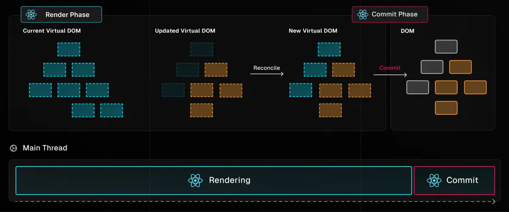
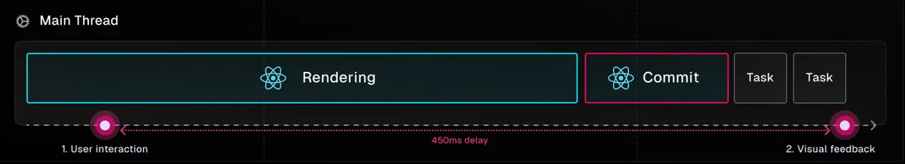

## Table of content

[1. Hooks](#1-hooks)   
[2. Side effects](#2-side-effects)  
[3. React rendering](#3-react-rendering)  
[4. Diffing algorithm - Reconlication](#4-diffing-algorithm---reconlication)   
[5. React Hydration](#5-react-hydration)    
     
[7. Grafana](#3-grafana) 


### 1. Hooks

<details>
<summary><b>useRef</b></summary>

**Khái niệm ref:** Trong React, ref là một thuộc tính của một tag hay một element đại diện cho chính nó. ref cho phép chúng ta truy cập đến DOM node hoặc React element đã được mount.

```html
<input type="text" ref={textInput} />
```
ref nhận vào một biến hoặc một function. Nếu là function thì function này sẽ được chạy khi element được mount.

```html
<button ref={(element) => console.log(element)}>Send</button>
```

Dùng useRef khi cần thao tác với các thành phần của DOM, ví dụ như input, div, span, p,…

`useRef.current` có thể gán trực tiếp được giá trị.

*Ví dụ:*
```tsx
function TextInputWithFocusButton() {
  const inputEl = useRef(null);
  const onButtonClick = () => {
    // `current` points to the mounted text input element
    inputEl.current.focus();
  };
  return (
    <>
      <input ref={inputEl} type="text" />
      <button onClick={onButtonClick}>Focus the input</button>
    </>
  );
}
```
Trong ví dụ này khi người dùng click chuột vào button thì input có ref là inputEl sẽ nhận focus. Điều này **useState** không thể làm được.
</details>

<details>
<summary><b>useState</b></summary>

```tsx
const [state, setState] = useState(initialValue);
```

- Có thể set trực tiếp `state` bằng: `state: ‘abc’`, nhưng khi đó component sẽ không re-render, component chỉ re-render khi set state bằnh hàm `setState(value)`
- Hàm `setState` là hàm bất đồng bộ, khi gọi hàm `setState`:
    - Component sẽ không được re-render ngay lập tức, mà React sẽ đánh dấu component đó cần re-render.
    - Giá trị `state` vẫn chưa được cập nhật ngay trong lần render hiện tại.
    - React dùng cơ chế batch update: gom nhiều setState trong cùng một sự kiện lại rồi thực hiện re-render một lần duy nhất, để tối ưu hiệu suất.
- hàm setState có thể nhận vào 1 giá trị hoặc 1 callback (function updater). Dùng function updater khi giá trị cần setState có liên quan đến giá trị trước của state
    - Khi gọi `setState(state + 1)` 3 lần liên tiếp thì state chỉ tăng lên 1 đơn vị ⇒ dùng `setState(state => state + 1)`

</details>


<details>
<summary><b>useEffect</b></summary>

- dependency:
    - Nếu không truyền: callback sẽ chạy lại mỗi khi component bị re-render (do sự thay đổi có props/state/do component cha re-render, v,v….)
    - Truyền mảng rỗng: sẽ chạy duy nhất khi component được render lần đầu tiên
    - Nếu dependency có tham số thì callback sẽ chạy lại mỗi khi tham số đó bị thay đổi (React dùng cơ chế **Shallow comparison** để so sánh sự thay đổi)
- Cleanup trong useEffect:

    ```tsx
    useEffect(() => {
        const timer = setInterval(() => { ... }, 1000);

        return () => clearInterval(timer); // cleanup
    }, []);
    ```
    Hàm này hoạt động như componentWillUnmount, dùng để reset các trạng thái, các timer, các interval được khai báo trong component

- Không thể khai báo trực tiếp async cho callback của useEffect:

    ```tsx
    useEffect(async () => {}, []) // ❌ Sai
    ```

- mà phải là
    ```tsx
    useEffect(() => {
        const fetchData = async () => { ... };

        fetchData();
    }, []);
    ```
</details>


<details>
<summary><b>useLayoutEffect</b></summary>

- useLayoutEffect khác useEffect ở chỗ là: nó sẽ chạy đồng bộ ngay từ trước khi component được render. Còn useEffect sẽ chạy sau khi component được mounting (nếu trong callback của useEffect có cập nhật state thì component sẽ bị re-render lại sau đó)
- useLayoutEffect thường dùng khi muốn thao tác với DOM ngay trước khi component được render (setValue, setSize, hiển thị sẵn giao diện, v.v…..)

</details>
<details>
<summary><b>useMemo</b></summary>

useMemo là lưu kết quả của hàm (giá trị), còn useCallback là lưu cả hàm (callback). Ví dụ: dùng useMemo để lưu lại kết quả của 1 hàm tính toán phức tạp dựa vào 1 biến: dependency nào đó; dùng useCallback khi muốn truyền 1 hàm nào đó vào component khác dưới dạng props
</details>

<details>
<summary><b>useCallback</b></summary>

</details>
<details>
<summary><b>useContext</b></summary>

</details>
<details>
<summary><b>useReducer</b></summary>

</details>

### 2. Side effects
Side-Effect là chức năng quan trọng giúp thực hiện hành động cùng với thành phần bên ngoài React. Bao gồm các tính năng chính như:

- **Tạo Request** cho dữ liệu từ máy chủ Backend tới API.
- Tương tác với API của trình duyệt như Document hay Window, cập nhật title trang, v.v….
- Sử dụng các chức năng tính thời gian không dự đoán được như `setTimeout` hay `setInterval`.

Việc sử dụng **Side-Effect** sẽ không trả về kết quả có thể dự đoán được. Vì thế các `useEffect` được sinh ra để kiểm soát các hoạt động của Side-effect.

Cốt lõi side effect không chỉ có ở Reactjs mà nó có ở bất cứ ngôn ngữ lập trình nào. 

`side effect` là **mọi hiệu ứng của một hàm hoặc đoạn mã xảy ra ngoài phạm vi logic chính mà nó được thiết kế để thực hiện**, như làm thay đổi trạng thái bên ngoài hàm.

Ví dụ đơn giản hàm một hàm **submitLogin**. Sau khi user nhập username và pass xong nhấn submit thì sẽ trigger hàm submitLogin. Trong hàm submitLogin này sẽ làm những việc này

1. Submit thông tin lên server và nhận thông tin trả về

2. Nếu trạng thái thành công redirect sang Dashboard

3. Nếu trạng thái thất bại sẽ hiển thị lỗi

Ở đây theo như tên gọi submitLogin thì công việc chính của nó là (1). (2) và (3) là side effect vì nó không phải là nhiệm vụ chính của hàm và phải dựa vào kết quả từ (1)


### 3. React rendering

Trong React, quá trình cập nhật giao diện được chia làm 2 giai đoạn:



**Render Phase:**

- Current Virtual DOM: trạng thái hiện tại của cây Virtual DOM.
- Updated Virtual DOM: khi React nhận thấy một thay đổi (từ props hoặc state), nó tạo một Virtual DOM mới để phản ánh sự thay đổi.
- Reconciliation: React so sánh Current Virtual DOM với Updated Virtual DOM (bằng Diffing algorithm). Các phần tử được thêm, sửa hoặc xóa được đánh dấu

Lưu ý: giai đoạn này chỉ là tính toán, không có thay đổi thực tế nào xảy ra trên DOM. Giai đoạn này chạy bất đồng bộ và đảm bảo không gây ảnh hưởng đến giao diện người dùng.

**Commit Phase:**

- React áp dụng các thay đổi từ Virtual DOM vào DOM thật
- Tạo, xóa hoặc cập nhật các thành phần DOM cần thiết để giao diện khớp với Virtual DOM mới.

Lưu ý: là giai đoạn thay đổi thực sự trên giao diện người dùng. Nó được thực thi trên Main Thread, vì vậy cần được tối ưu để không gây gián đoạn.

Đối với quá trình render đồng bộ, độ ưu tiên của tất cả component là như nhau. Khi component được render, dù là render ban đầu hay cập nhật state, React sẽ tiếp tục render trong một tác vụ duy nhất không bị gián đoạn, sau đó commit với DOM để cập nhật component trên màn hình.



Render đồng bộ là hoạt động "tất cả hoặc không có gì", trong đó đảm bảo rằng component render sẽ luôn hoàn tất. Tùy thuộc vào độ phức tạp của các component, giai đoạn render mất khoảng thời gian ít hoặc lâu để hoàn tất.

Trong lúc đó, main thread sẽ bị chặn, nghĩa là người dùng cố gắng tương tác nhưng ứng dụng sẽ không phản hồi cho đến khi React hoàn tất render và commit kết quả với DOM.


### 4. Diffing algorithm - Reconlication

### **Diffing algorithm**

Là thuật toán React dùng để kiểm tra sự thay đổi khi có sự cập nhật, giữa Vitual DOM mới và Vitual DOM được tạo ra trước đó. Mục đích là tối ưu hoá quá trình cập nhật giao diện, chỉ re-render những thành phần nào có sự thay đổi

**Quá trình thực hiện:**

- Khi một thành phần React thay đổi trạng thái (state) hoặc thuộc tính (props), React sẽ tạo ra một cây Virtual DOM mới.
- Sau đó, React sử dụng thuật toán diff để so sánh cây Virtual DOM mới này với cây Virtual DOM cũ đã có trước đó.
- Diffing algorithm tìm ra những phần tử trong cây Virtual DOM cần phải cập nhật (thay đổi), những phần tử cần thêm vào hoặc loại bỏ để phản ánh đúng trạng thái mới của ứng dụng.

***Đối với DOM element khác loại:**

Bất cứ khi nào các root element có nhiều loại khác nhau, React sẽ phá bỏ tree cũ và xây dựng tree mới từ đầu.

Khi phá bỏ một tree, các DOM node cũ sẽ bị destroy (phá hủy). Component instances nhận `componentWillUnmount()`. Khi xây dựng một tree mới, các DOM node mới sẽ được chèn vào DOM. Component instances nhận `componentDidMount()`. Bất kỳ state nào gắn với tree cũ đều sẽ bị mất đi.

```html
<!-- Khi compont bị sửa từ -->
<div>
  <Counter />
</div>
<!-- thành -->
<span>
  <Counter />
</span>
```

Thao tác này sẽ destroy Counter cũ và remount (gắn lại) một Counter mới.


***Đối với DOM element cùng loại:**

Khi so sánh hai React DOM element cùng loại, React sẽ xem xét các attribute (thuộc tính) của cả hai, giữ cùng một DOM node cơ bản và chỉ cập nhật các attribute đã thay đổi

```html
<div className="before" title="title" />
<!-- thành -->
<div className="after" title="title" />
```

Bằng cách so sánh hai element này, React biết chỉ sửa đổi `className` trên DOM node bên dưới.

***Đối với Component cùng loại:**

Khi một component được cập nhật, trường hợp vẫn như cũ, thì state đó được duy trì qua các lần render (hiển thị). React cập nhật các prop của các component instance bên dưới để khớp với element mới và gọi  `componentDidUpdate()` trên cá thể bên dưới.

Tiếp theo, `render()` method được gọi và thuật toán diff lặp lại trên kết quả trước đó và kết quả mới.

***Recursing On Children**

Theo mặc định, khi đệ quy trên các children của một DOM node, React chỉ lặp lại trên cả hai danh sách children cùng một lúc và tạo ra một sự biến đổi bất cứ khi nào thấy sự khác biệt.

VD: khi thêm một element vào cuối phần tử children, việc chuyển đổi giữa hai tree này hoạt động tốt:

```html
<ul>
  <li>first</li>
  <li>second</li>
</ul>
<!-- thành -->
<ul>
  <li>first</li>
  <li>second</li>
  <li>third</li>
</ul>
```

React sẽ so sánh và thấy khớp giữa hai tree `<li>first</li>`, tương tự hai tree `<li>second</li>` và sau đó chèn tree `<li>third</li>`.

Nhưng nếu chèn một element vào đầu sẽ có thể gây ra hiệu suất kém hơn

```html
<ul>
  <li>Duke</li>
  <li>Villanova</li>
</ul>

<ul>
  <li>Connecticut</li>
  <li>Duke</li>
  <li>Villanova</li>
</ul>
```

React sẽ thay đổi mọi child thay vì nhận ra rằng nó có thể giữ nguyên các subtree `<li>Duke</li>` và `<li>Villanova</li>`. Sự kém hiệu quả này có thể là một vấn đề.

Để giải quyết vấn đề này, React hỗ trợ một `key` attribute. Khi children có key, React sử dụng key để ghép những children ở tree ban đầu với những children ở tree tiếp theo. Ví dụ: thêm một `key` vào từ ví dụ kém hiệu quả của chúng tôi ở trên có thể làm cho việc chuyển đổi tree trở nên có hiệu quả hơn

### Reconciliation

Reconciliation là quá trình mà React thực hiện re-render sau khi đã áp dụng thuật toán diff để cập nhật giao diện người dùng theo các thay đổi đã xác định.


### 5. React Hydration

Hydration là quá trình chuyển đổi HTML được render sẵn trên máy chủ thành dạng tương tác trên trình duyệt. 

**React** sẽ kiểm tra HTML hiện có và liên kết JavaScript cần thiết để kích hoạt các thành phần, cho phép tương tác diễn ra. Điều này giúp tăng tốc độ tải trang vì nội dung tĩnh (HTML ban đầu) được tải nhanh chóng, sau đó mới kích hoạt tính tương tác.

Hydration không áp dụng cho các thư viện hoặc framework chỉ hoạt động trên phía client (client-only), mà chỉ hoạt động với các trang web SSR


