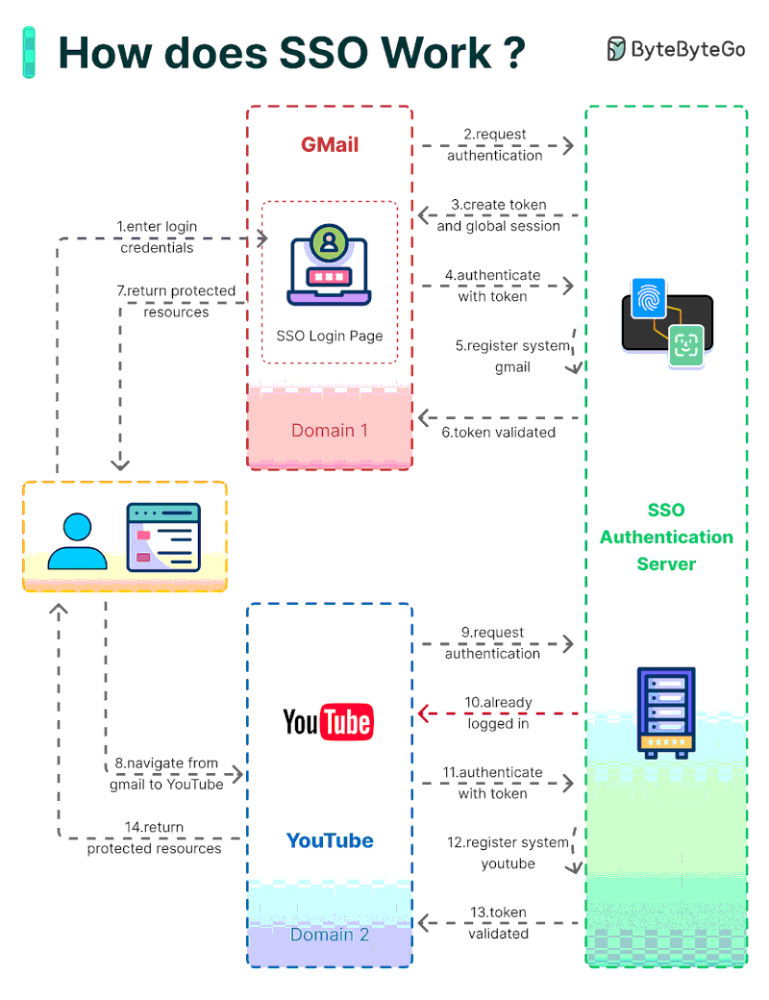

## Table of content

[1. Nguyen ly SOLID](#1-nguyen-ly-solid)  
[2. Định lý CAP](#2-dinh-ly-cap)  
[3. IoC (Inversion of Control)](#3-ioc-inversion-of-control)   
[4. Event Sourcing](#4-event-sourcing)    
[5. Sync data từ SQL to Elasticsearch](#4-event-sourcing)     
[6. Hexagonal Architecture](#4-hexagonal-architecture)      
[7. Serverless Architecture](#4-serverless-architecture)  
[7. SSO](#4-sso)  


### 1. Nguyen ly SOLID
- **S: Single Responsibility Principle (SRP)**
    - Mỗi lớp (class) trong app chỉ nên có một trách nhiệm duy nhất.
    Hay nói cách khác, một lớp chỉ nên có một lý do duy nhất để thay đổi.
- **O: Open/Closed Principle (OCP)**
    - Open for extend but close for modifying. Nguyên lý này đề cập đến việc có thể thoải mái mở rộng 1 class/function nhưng không được phép chỉnh sửa trực tiếp trên class đó (Tất nhiên ở đây là nói đến việc mở rộng, phát triển tính năng chứ không phải là sửa lỗi)
- **L: Liskov Substitution Principle (LSP)**
    - Các đối tượng của một lớp con phải có thể thay thế cho các đối tượng của lớp cha mà không làm thay đổi tính đúng đắn của chương trình.
- **I: Interface Segregation Principle (ISP)**
    - Thay vì tạo ra 1 interface chung với tất cả các chức năng, thì nên tách ra thành nhiều interface con với từng nhóm chức năng cụ thể, điều này giảm sự implement dư thừa nếu 1 class phải implement 1 interface quá lớn
- **D: Dependency Inversion Principle (DIP)**
    - Các module cấp cao không nên phụ thuộc vào các modules cấp thấp. Cả 2 nên phụ thuộc vào abstraction. Interface (abstraction) không nên phụ thuộc vào chi tiết, mà ngược lại. ( Các class giao tiếp với nhau thông qua interface, không phải thông qua implementation)
    - Giả sử như ở Controller cần gọi Service, thì ở đây không nên inject trực tiếp class Service vào Controller mà nên tạo ra 1 Service Interface để Controller inject
    - Lợi ích là giúp giảm sự phục thuộc trực tiếp giữa Service và Controller  (loose coupling), và giúp dễ dàng mở rộng hơn (giả sử sau này muốn chỉnh sửa thì chỉ cần chỉnh sửa trong lớp Service Implement, hoặc muốn nâng cấp version thì tạo thêm 1 implement khác)
    - Khi chương trình được tạo, nó sẽ quét qua tất cả các lớp có gắn anotation là `@Component`, `@Service`, `@Controller`, `@Repository`, v.v… (tóm lại là các Bean), và đăng ký nó với Spring Context/IoC Container
    - Khi quét tới class Service Implement, vì class này có đánh anotation `@Service` nên nó sẽ được khai báo với IoC Container, với  type là chính nó, cùng với type là interface Service, vì nó là implementation của interface Service
    - Nên khi trong Controller inject Service, lúc đó Spring sẽ kiểm tra trong IoC Container xem có Bean nào có type là Service không, và nó tìm thấy class Service Implement (vì nó đã được gắn `@Service`), nên thật chất là Controller inject class Service Implement
    - Nếu 1 Service interface có 2 implement trở lên, ứng dụng sẽ báo lỗi, và ta phải đặt `@Primary` hoặc `@Qualifier` cho implement chính
  
    **Tại sao là interface mà không phải là abstract class:**
  - Interface hỗ trợ đa kế thừa, còn abstract class thì không

    ```java
    public interface Searchable {}
    public interface Sortable {}

    public class ProductServiceImpl implements ProductService, Searchable, Sortable {}
    ```

  - Trong interface chỉ có các abstract method, không có implementation → đảm bảo được tính thống nhất giữa các class implementation


### 2. Định lý CAP
- **C: Consistency**
    
    Tính nhất quán đảm bảo rằng mọi node trong hệ thống đều có cùng một trạng thái dữ liệu tại cùng một thời điểm. Khi bạn cập nhật dữ liệu trên một node (ví dụ: node A), tất cả các node khác (B, C...) phải ngay lập tức phản ánh giá trị đã được cập nhật. Nếu không thể đảm bảo điều này, hệ thống sẽ từ chối yêu cầu thay vì trả về dữ liệu cũ.
    
    Đây là lựa chọn của các lĩnh vực quan trọng như ngân hàng, thanh toán, hay đặt vé máy bay, nơi mà bất kỳ sai sót nào cũng có thể dẫn đến hậu quả nghiêm trọng.
    
- **A: Availability**
    
    Tính sẵn sàng đảm bảo rằng hệ thống luôn phản hồi các yêu cầu của người dùng, miễn là node phục vụ yêu cầu đó không bị lỗi. Mọi yêu cầu gửi đến một node hoạt động bình thường đều phải được phản hồi. Không có tình trạng "server đang bận, vui lòng thử lại sau". Nếu phải lựa chọn giữa việc trả về dữ liệu cũ hoặc không trả về gì, hệ thống sẽ ưu tiên trả về dữ liệu cũ.
    
    Đây là lựa chọn của các trang mạng xã hội, blog hay các trang tin tức, nơi mà người dùng chấp nhận việc nhìn thấy nội dung cũ còn hơn không thấy bất kỳ thông tin nào.
    
- **P: Partition Tolerance**
    
    Partition Tolerance đảm bảo rằng hệ thống vẫn tiếp tục hoạt động ngay cả khi xảy ra sự cố mạng khiến các node trong hệ thống không thể kết nối với nhau. Partition Tolerance không phải là một lựa chọn, bạn bắt buộc phải thiết kế hệ thống có khả năng chịu được sự cố này, bởi vì các vấn đề về mạng như mất kết nối hay chập chờn là điều không thể tránh khỏi trong thực tế.

    
Trong thực tế, trong hệ thống không thể đảm bảo thoã mãn cả 3 tính chất của CAP, mà bắt buộc phải có sự đánh đổi

***Hệ thống ưu tiên CP** (Consistency và Partition Tolerance): sẽ đặt tính đúng đắn của dữ liệu lên trên tất cả, thậm chí là hơn cả sự sẵn sàng phục vụ của hệ thống. Điều này đồng nghĩa với việc, khi xảy ra Partition, hệ thống sẽ từ chối các yêu cầu nếu không thể đảm bảo tính nhất quán giữa tất cả các node. 

Ví dụ: transaction chuyển tiền.

- User: Chuyển tiền 1.000.000 VND đến tài khoản B.
- System: "Xin lỗi, không thể xác nhận giao dịch lúc này do sự cố kết nối. Vui lòng thử lại sau."
- Hệ thống CP từ chối xử lý giao dịch này bởi vì nó không thể đảm bảo dữ liệu về số dư tài khoản sẽ được cập nhật đồng bộ trên tất cả các node, một số node trong hệ thống đang không phản hồi, và điều gì sẽ xảy ra nếu người dùng chuyển quá số tiền họ có trong tài khoản? Hay người gửi nói rằng giao dịch thành công, nhưng người nhận không nhận được tiền.

***Hệ thống ưu tiên AP** (Availability và Partition Tolerance) sẽ đặt mục tiêu duy trì tính sẵn sàng lên hàng đầu, ngay cả khi điều này dẫn đến việc dữ liệu tạm thời không nhất quán giữa các node. Trong trường hợp xảy ra Partition, mỗi node trong cluster sẽ tiếp tục xử lý yêu cầu của người dùng, bất kể chúng có thể tạm thời "không đồng ý" về trạng thái dữ liệu.

Ví dụ: trong 1 ứng dụng mạng xã hôi:

- User 1 (kết nối với Node A): Thêm bình luận: "abc xyz!"
- User 2 (kết nối với Node B): Không thấy bình luận đó
- System: "Không vấn đề gì! Họ sẽ thấy bình luận khi mạng được khôi phục và dữ liệu đồng bộ lại."

Hệ thống AP đánh đổi tính nhất quán tạm thời để đảm bảo rằng mỗi yêu cầu từ người dùng được xử lý ngay lập tức. Điều này đặc biệt phù hợp cho các ứng dụng ưu tiên trải nghiệm liền mạch của người dùng – việc hệ thống "không khả dụng" (downtime) sẽ gây khó chịu nhiều hơn so với việc hiển thị dữ liệu chưa được cập nhật hoặc không đồng nhất.

### 3. IoC (Inversion of Control)
- Đảo ngược luồng kiểm soát
- Giả sử như ở Controller cần gọi đến Service để xử lý, thay vì ở Controller sẽ tạo Service service = new Service(), thì sẽ inject Service đã được tạo trước đó từ bên ngoài vào (Bằng cơ chế Dependency Injection, hay nói cách khác DI là 1 kỹ thuật để IoC)
- Lúc này các Bean (các Service, Repository, v.v..) sẽ do Framework (Srping Context/IoC Container) quản lý tập trung, chứ không phải do nơi khởi tạo quản lý
- Các Bean được inject sẽ được tự động implenent cơ chế Singleton
- IoC giúp dễ dàng kiểm soát, quản lý và test các Bean, tránh tình trạng tạo mới rải rác ở nhiều nơi dẫn đến khó hoặc sót khi quản lý và test
  
*Dùng Java thuần (không Spring boot): vẫn có thể DI (thông qua constructor), nhưng không thể IoC, do không có công cụ quản lý vòng đời của bean. Đối tượng phải được tạo mới bằng Service s = new Service() (và phải tự implement các cơ chế như singleton, v.v), và destroy khi không sử dụng nữa bằng cách ngắt tham chiếus = null (hoặc nếu service có tài nguyên cần đóng, ví dụ như kết nối file, database thì s.close()) và chờ GC thu gom


### 4. Event Sourcing
> **Event Sourcing** là cách lưu trữ trạng thái của một ứng dụng bằng cách ghi lại tất cả các sự kiện (events) đã thay đổi trạng thái của hệ thống, thay vì chỉ lưu trạng thái hiện tại. Trạng thái của hệ thống tại bất kỳ thời điểm nào có thể được tái tạo bằng cách phát lại (replay) các sự kiện này từ đầu.
> 

**Nguyên tắc cốt lõi:**

- Mỗi hành động thay đổi trạng thái (state-changing action) trong hệ thống được biểu diễn dưới dạng một **event**.
- Các event được lưu trữ trong một **event store** (thường là cơ sở dữ liệu hoặc log sự kiện) theo thứ tự thời gian.
- Trạng thái hiện tại của hệ thống được tính toán bằng cách áp dụng (apply) tất cả các event từ đầu đến thời điểm hiện tại.

### Cách hoạt động của Event Sourcing

**Các thành phần chính**

**1. Event**

Là một bản ghi (record) mô tả một thay đổi trạng thái đã xảy ra (past tense), ví dụ: `OrderCreated`, `OrderShipped`.

Event thường bao gồm:

- Loại sự kiện (eventType).
- Dữ liệu liên quan (payload): Ví dụ, orderId, total.
- Thời gian xảy ra (timestamp).
- Có thể có thêm metadata (như ID sự kiện, phiên bản).

**2. Event Store**
- Là nơi lưu trữ tất cả các sự kiện, thường là một cơ sở dữ liệu (như **EventStoreDB**, **Kafka**, hoặc cơ sở dữ liệu quan hệ với bảng events).
- Các sự kiện được lưu **theo thứ tự thời gian** và không bao giờ bị xóa (append-only log).
- 
**3. Aggregate**
- Là thực thể (entity) trong hệ thống mà trạng thái của nó được xây dựng từ các sự kiện (ví dụ: một Order).
- Aggregate áp dụng các sự kiện để tái tạo trạng thái hiện tại.

**4. Event Handler**
    
Logic xử lý từng sự kiện để cập nhật trạng thái của aggregate.
    
**Quy trình**
    
1. **Khi một hành động xảy ra** (ví dụ: người dùng đặt hàng), hệ thống tạo một event (OrderCreated) và lưu vào event store.
2. **Tái tạo trạng thái:** Để lấy trạng thái hiện tại, hệ thống đọc tất cả các sự kiện liên quan đến aggregate (ví dụ: tất cả sự kiện của `orderId=123`) và áp dụng chúng theo thứ tự.
3. **Phát hành sự kiện:** Các sự kiện có thể được phát ra (publish) để các hệ thống khác xử lý (ví dụ: gửi email thông báo qua notification-service).

**Ưu điểm**

- **Audit Trail (Theo dõi lịch sử)**: Mọi thay đổi trạng thái đều được ghi lại, dễ dàng kiểm tra lịch sử (ví dụ: ai đã thay đổi đơn hàng, khi nào).
- **Tái tạo trạng thái linh hoạt**:
    - Có thể tái tạo trạng thái tại bất kỳ thời điểm nào bằng cách phát lại một phần hoặc toàn bộ sự kiện.
    - Dễ dàng thêm logic mới (chỉ cần thay đổi cách áp dụng sự kiện).
- **Hỗ trợ debug và phân tích:**
    - Dễ dàng debug lỗi vì có thể xem toàn bộ chuỗi sự kiện dẫn đến trạng thái hiện tại.
    - Hỗ trợ phân tích dữ liệu (ví dụ: phân tích hành vi người dùng từ các sự kiện).
- **Tích hợp với hệ thống phân tán**:
    - Dễ dàng tích hợp với **CQRS (Command Query Responsibility Segregation)**.
    - Sự kiện có thể được phát hành (publish) để các microservices khác xử lý (ví dụ: gửi thông báo, cập nhật kho).
- **Khả năng phục hồi:** Nếu trạng thái bị lỗi, có thể tái tạo lại từ sự kiện.
    
    

**Nhược điểm**

- **Phức tạp trong triển khai**
    - Cần quản lý event store, đảm bảo thứ tự sự kiện, và xử lý xung đột.
    - Logic tái tạo trạng thái có thể phức tạp, đặc biệt với hệ thống lớn.
- **Hiệu năng**
    - Tái tạo trạng thái bằng cách phát lại tất cả sự kiện có thể chậm nếu số lượng sự kiện lớn.
    - Giải pháp: Dùng **snapshots** (lưu trạng thái tại một thời điểm để giảm số sự kiện cần phát lại).
- **Khó thay đổi schema sự kiện**: Nếu format của sự kiện thay đổi (event versioning), cần xử lý để hỗ trợ cả sự kiện cũ và mới.
- **Tốn tài nguyên lưu trữ**: Event store lưu tất cả sự kiện (append-only), có thể tăng kích thước nhanh chóng.
- **Khó khăn trong truy vấn**: Vì dữ liệu được lưu dưới dạng sự kiện, truy vấn trực tiếp (như SQL) không dễ dàng. Cần kết hợp với CQRS để tạo **read model** riêng.
    
    

**Các công cụ hỗ trợ Event Sourcing**

- **EventStoreDB**: Cơ sở dữ liệu chuyên dụng cho Event Sourcing, hỗ trợ lưu trữ và truy vấn sự kiện.
- **Apache Kafka**: Dùng để lưu trữ và phát hành sự kiện trong hệ thống phân tán.
- **Axon Framework**: Framework Java hỗ trợ Event Sourcing và CQRS.
- **Redis Streams**: Dùng để lưu trữ sự kiện tạm thời hoặc làm message broker.
- **Cơ sở dữ liệu quan hệ**: Có thể dùng PostgreSQL/MySQL với bảng events (nhưng không tối ưu bằng EventStoreDB).


### 5. Sync data từ SQL to Elasticsearch

***Phân tích bài toán:**
- Dữ liệu cần đưa sang ES là gì?
- Sync realtime hay chỉ cần batch (định kỳ)?
- Khối lượng dữ liệu nhiều ít ra sao?
- Có cần mapping custom fields không?

***Cách triển khai:**

Các cách thường gặp để sync SQL -> Elasticsearch:

- Viết job ETL tự custom: thích hợp cho các dữ liệu ít, đơn giản
    
    Flow cơ bản
    
    - Kết nối database (JDBC hoặc JPA)
    - Đọc data
    - Mapping thành document phù hợp với ES (có thể cần transform một số field)
    - Gọi API bulk insert để đẩy batch 100–500 documents/lần => giảm số lần gọi API
- Dùng Java, Python, NodeJS,..v.v.., đọc từ DB -> chuyển thành JSON -> push vào Elasticsearch qua API
- Dùng tool trung gian
    
    Ví dụ:
    
    - Logstash (có plugin jdbc-input)
    - Debezium (CDC – Change Data Capture) (thích hợp cho dữ liệu nhiều/yêu cầu real time)
    - Kafka Connect (có connector từ MySQL/PostgreSQL đến Elasticsearch)

**Một vài lưu ý**:

- Bulk size phải vừa phải (quá to dễ timeout)
- Handle lỗi cẩn thận khi insert document (nhất là network hoặc mapping lỗi)
- Nếu dữ liệu lớn, nhớ phân trang khi đọc từ DB. Đừng có select * from table một phát chết server
- Có thể đánh dấu “last sync id” hoặc “last update time” để incremental sync thay vì quét hết
- Mapping dữ liệu: định nghĩa mapping chuẩn trong Elasticsearch để tối ưu search (ví dụ field nào cần text search thì phân tích, field nào chỉ để filter thì keyword thôi)


### 6. Hexagonal Architecture

### 7. Serverless Architecture


### 8. SSO

